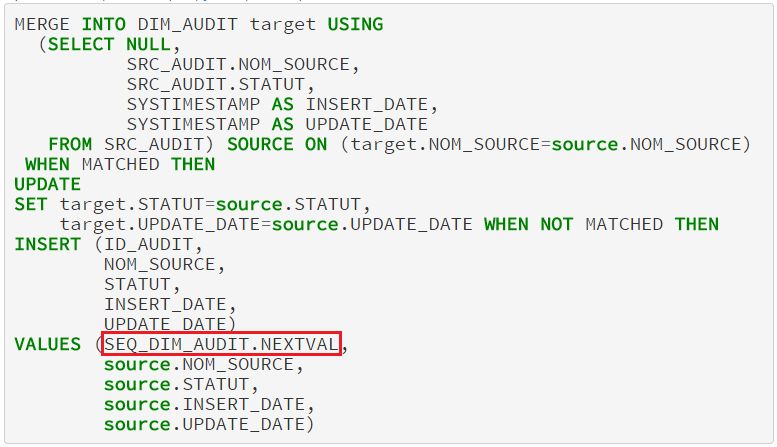

# tELTOracleOutputSEQ
Le composant tELTOracleOutputSEQ est une évolution, du composant tELTOracleOutput de Talend, qui permet l'utilisation d'une séquence dans le cas du MERGE/INSERT. 
    

# Installation
Voici les étapes à suivre pour installer le composant :
<ul>
<li>1. Spécifier un dossier pour les composants utilisateur  
    Il faut se rendre dans le menu Windows -> Preferences -> Talend -> Components   
    Dans le champ <b>Dossier des composants utilisateur</b> renseigner le dossier dans lequel vous allez déposer le nouveau composant.  Par exemple :  
      <i>C:\Talend5.6.1\TOS_DI-20141207_1530-V5.6.1\custom</i>
<li>2. Télécharger le zip d'ici et le sauvegarder dans le dossier spécifier dans l'étape 1 </li>

<li>3. En fonction de votre version, modifier le fichier <b>tELTOracleOutputSEQ_main.javajet</b>.  
La ligne suivante doit pointer sur le bon répertoire du fichier <b>Log4jDBConnUtil.javajet </b>:   
    <%@ include file="../../plugins/org.talend.designer.components.localprovider_5.6.1.20141207_1530/components/templates/Log4j/Log4jDBConnUtil.javajet"%>
    </li>
    <li>4. Utiliser les touches CTRL+SHIFT+F3 afin de faire apparaitre le nouveau composant dans la palette (ELT/Map/Oracle).</li>
</ul>     

# Utilisation
Voici les étapes à suivre pour utiliser le composant:
<ul>
<li>1. Relier le nouveau composant à un tELTOracleMap</li>
<li>2. Paramétrer le composant en suivant la capture d'écran ci-dessous :

L'option permettant l'utilisation d'une séquence apparait dans l'étape 4. Vous pouvez désormais utiliser une séquence afin d'alimenter la clé primaire de la table (décocher dans l'étape 3).    

Certes, il y a d'autres solutions de contournement afin d'arriver au même résultat : utilisation de trigger, de procédure stockée, etc. Mais c'est toujours mieux d'avoir un seul composant permettant la réalisation de tout le traitement update, insert et l'appel à la séquence.   

</li>
<li>3. Spécifier la clé fonctionnelle de la table car celle-ci sera utilisée pour générer la requête du MERGE. Cf. la capture d'écran ci-dessous. 

</li>
</ul>

# Résultat 
Voici la requête générée et envoyée au SGBD :

# Contributor

Jamal EL Mansouri

# License

Licensed under the Apache V2 License

